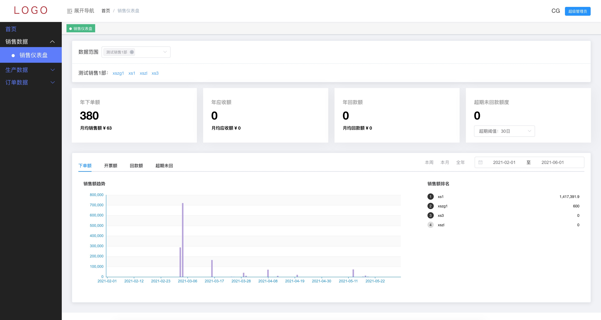
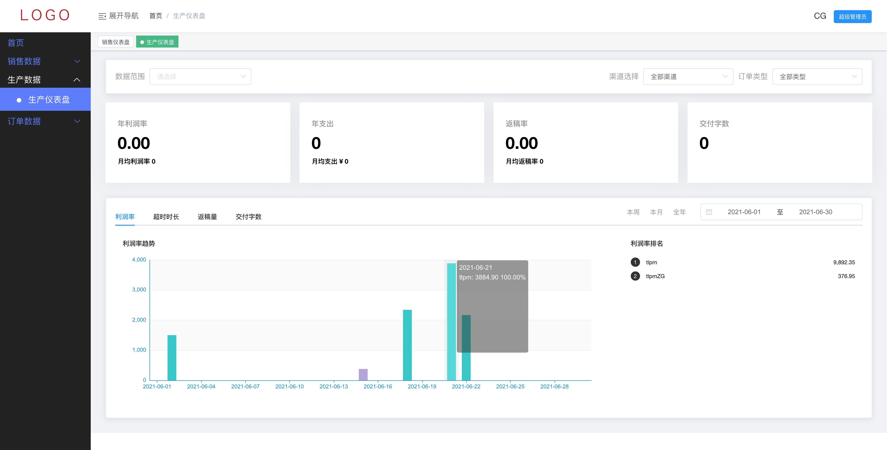

# Springboot-Vue-ElementUI-eCharts
## 关于本项目
 文章介绍：[SpringBoot + Vue Element UI 实现前后端分离]  
这个小项目是一个 springboot 和 vue 的案例，主要用eCharts展示统计数据表。

- admin 是 vue 项目，请使用 Visual Studio Code 之类前端工具打开，请确保已安装 node 和 npm
- api 是 springboot 项目，请使用 IDEA 等后端工具打开，确保安装了 MySQL5.x，jdk1.8

## 项目启动
- 前端项目·
  1. 执行 `yarn` 或 `npm install` 下载依赖，如果下载失败，请删除 package-lock.json 文件，执行 `npm cache clean --force` 命令，然后重新尝试
  2. 执行 `npm run start`
  3. 启动成功后，端口是19090，没做登录页面，直接用的 URL 鉴权。不同角色的管理员有不同的权限，具体的地址如下：
	3.1. 超管 http://localhost:19090/admin/index.html/#/home?accountId=5366993f-d84c-11e8-a52d-d00de9e85bfd&accountMd5=b6219e1625c3092f81782ff7d9e7e85a
	3.2. 销售 http://localhost:19090/admin/index.html/#/home?accountId=53413f52-d84c-11e8-a52d-d00de9e85bfd&accountMd5=85c4fbf1a417887707114d46be2d797a
	3.3. 项目 http://localhost:19090/admin/index.html/#/home?accountId=52530a3c-d84c-11e8-a52d-d00de9e85bfd&accountMd5=6ed7ec25ee57130ce5c05d0533da3f4f
  4. 联调通过后打包，集中到后端项目，即 ./src/main/resources/adminDist 目录。
 
  
- 后端项目
  1. 按 ./db 目录分别创建数据库 translate_***，并导入 translate_***.sql 文件
  2. 使用 IDEA 以 Maven 方式导入 api 项目
  3. 修改 application.yml 和 application-dev(或 prod).yml 里的配置信息，即数据库账号密码
  4. 启动项目，端口是18080，没做登录页面，直接用的 URL 鉴权。不同角色的管理员有不同的权限，具体的地址如下：
	4.1. 超管 http://localhost:18080/admin/index.html/#/home?accountId=5366993f-d84c-11e8-a52d-d00de9e85bfd&accountMd5=b6219e1625c3092f81782ff7d9e7e85a
	4.2. 销售 http://localhost:18080/admin/index.html/#/home?accountId=53413f52-d84c-11e8-a52d-d00de9e85bfd&accountMd5=85c4fbf1a417887707114d46be2d797a
	4.3. 项目 http://localhost:18080/admin/index.html/#/home?accountId=52530a3c-d84c-11e8-a52d-d00de9e85bfd&accountMd5=6ed7ec25ee57130ce5c05d0533da3f4f
  5. 因考虑到统计数据来源与其它多表，实时查询对数据库的压力高，所以做了定时任务（每天凌晨处理）。同时也做了手动触发链接 http://localhost:18080/admin/index.html/#/manual，方便人工操作。

- 部分截图
 
 
